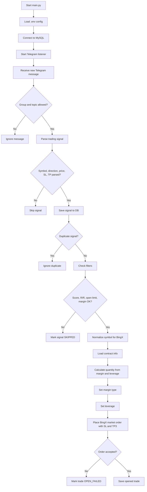
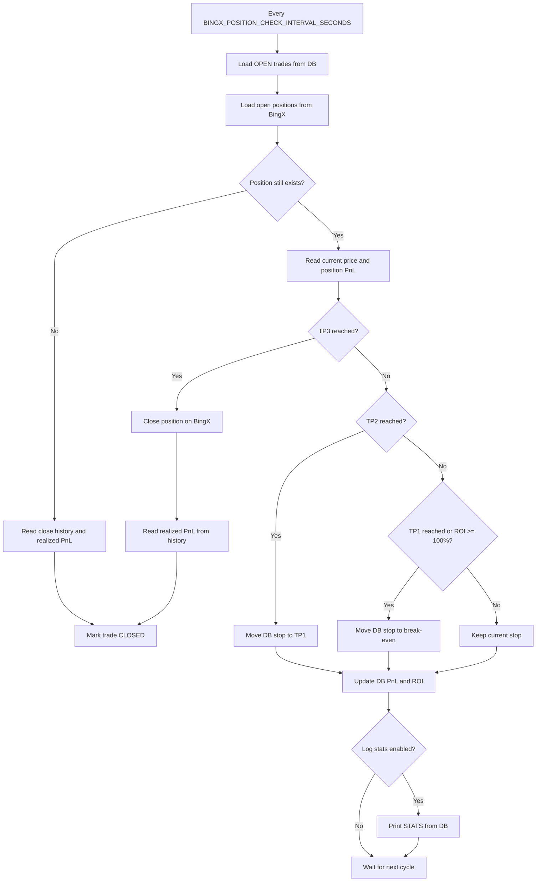

# BingX Autotrade

BingX Autotrade listens to configured Telegram chat topics, parses Aorus trading signals, stores them in MySQL, and opens BingX USDT perpetual positions when the signal passes the configured risk filters.

## How It Works

1. `main.py` starts the Telegram listener.
2. The listener accepts messages only from `GROUP_ID` and configured topics: `TOPIC_BOT_1`, `TOPIC_BOT_2`.
3. `signal_parser` extracts `symbol`, `direction`, `price`, `sl`, `tp1`, `tp2`, `tp3`, `signal_score`, and market fields.
4. The parsed signal is inserted into the `signals` table.
5. `bingx_trader` checks:
   - `signal_score >= MIN_SIGNAL_SCORE`;
   - risk/reward to TP3 is at least `BINGX_RISK_REWARD_RATIO`;
   - currently open trades are below `BINGX_LIMIT_OPENED_POSITIONS`;
   - no active trade or BingX position already exists for the same symbol;
   - `BINGX_MARGIN > 0`.
6. If eligible, the bot calculates order quantity from `BINGX_MARGIN * BINGX_LEVERAGE`, caps leverage to the contract maximum when available, and submits a BingX market order with TP3 and SL.
7. The result is stored in the `trades` table.
8. A background monitor checks open trades every `BINGX_POSITION_CHECK_INTERVAL_SECONDS` seconds:
   - TP1 or ROI `>= 100%`: move DB stop to break-even including fees;
   - TP2: move DB stop to TP1 including fees;
   - TP3: close the position and mark the trade closed;
   - if the exchange position no longer exists, mark the trade closed based on price evidence.
   - active PnL is read from the BingX open position when available;
   - realized PnL is read from BingX income/fill/order history when a trade closes.

## Flowchart





## Requirements

- Python 3.13 or compatible.
- MySQL.
- Telegram API credentials: `TELEGRAM_API_ID`, `TELEGRAM_API_HASH`, `TELEGRAM_PHONE`.
- Access to the target Telegram group and topics.
- BingX API key/secret with futures read and trade permissions.

## Setup

```powershell
python -m venv .venv
.\.venv\Scripts\pip.exe install -r requirements.txt
Copy-Item .env.example .env
```

Fill `.env`, create the MySQL database configured in `DB_DATABASE`, then apply migrations:

```powershell
.\.venv\Scripts\python.exe -m app.db_migrate
```

For an existing database that already has the current schema:

```powershell
.\.venv\Scripts\python.exe -m app.db_migrate --baseline
```

## Run

```powershell
.\.venv\Scripts\python.exe main.py
```

On the first run, Telethon may ask for Telegram authorization and create a session file in the project directory.

## Stats

Print current trade counters, active unrealized PnL/ROI, closed realized PnL/ROI, and total PnL/ROI:

```powershell
.\.venv\Scripts\python.exe -m app.stats
```

## Environment Variables

`TELEGRAM_API_ID`, `TELEGRAM_API_HASH`, `TELEGRAM_PHONE`: Telegram API credentials.

`TELEGRAM_SESSION_NAME`: Telethon session file name.

`GROUP_ID`: Telegram group ID.

`TOPIC_BOT_1`, `TOPIC_BOT_2`: Telegram topic IDs to listen to.

`MIN_SIGNAL_SCORE`: minimum accepted signal score.

`DB_HOST`, `DB_PORT`, `DB_DATABASE`, `DB_USERNAME`, `DB_PASSWORD`: MySQL connection settings.

`BINGX_MODE`: `live` or `demo`. `demo`, `testnet`, `paper`, and `sandbox` enable demo mode in the app.

`BINGX_BASE_URL`: optional BingX API base URL override. Leave empty unless BingX provides a separate demo/testnet URL for your account.

`BINGX_API`, `BINGX_SECRET`: BingX API key and secret.

`BINGX_LIMIT_OPENED_POSITIONS`: maximum number of simultaneously open trades.

`BINGX_MARGIN`: margin per position in USDT.

`BINGX_LEVERAGE`: requested leverage.

`BINGX_RISK_REWARD_RATIO`: minimum ratio between potential profit to TP3 and risk to SL.

`BINGX_POSITION_CHECK_INTERVAL_SECONDS`: open position check interval.

## BingX Notes

The bot uses BingX swap v2 endpoints under `https://open-api.bingx.com`, with symbols normalized from `BTCUSDT` to `BTC-USDT`. If `BINGX_MODE=demo`, the app logs demo mode and uses the configured API credentials; set `BINGX_BASE_URL` only if your BingX demo/testnet credentials require a separate endpoint.

Stop-loss replacement after TP1/TP2 is currently stored in the database only. Verify BingX stop-order modification behavior on your account before relying on automatic exchange-side SL moves.

## Donations

Being a programmer in Ukraine is pretty sad and not easy right now. If this project helps you, donations are welcome and appreciated.

USDT TRC20:

```text
TFBjfyG4gtuFzmB27SePWfcLyBfEtmuavo
```
