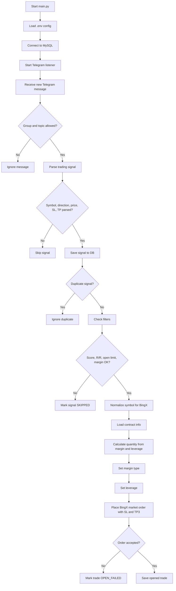
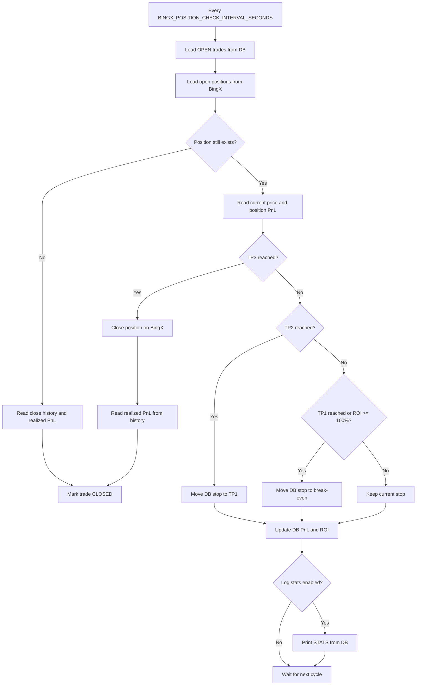

# BingX Autotrade

BingX Autotrade can trade from two independent signal sources:

- Telegram signals from configured Telegram topics.
- Own strategy signals from `RS_PULLBACK_V1` (`Relative Strength Pullback v1`).

Both sources store signals and trades in MySQL and use the same BingX USDT perpetual execution and position monitor.

## How It Works

1. `main.py` loads `.env`, runs startup checks for BingX and, when own strategy is enabled, Coinalyze.
2. `SIGNAL_SOURCE_MODE` selects the active source:
   - `telegram`: Telegram listener only.
   - `own`: `RS_PULLBACK_V1` scanner only.
   - `both`: both sources.
3. The shared position monitor checks open exchange positions, PnL, ROI, TP/SL state, and prints `STATS`.

## Telegram Flow

1. `main.py` starts the Telegram listener when `SIGNAL_SOURCE_MODE=telegram` or `both`.
2. The listener accepts messages only from `GROUP_ID` and configured topics: `TOPIC_BOT_1`, `TOPIC_BOT_2`.
3. `signal_parser` extracts `symbol`, `direction`, `price`, `sl`, `tp1`, `tp2`, `tp3`, `signal_score`, and market fields.
4. The parsed signal is inserted into the `signals` table.
5. Once per UTC day, the bot saves the latest Alternative.me Crypto Fear & Greed Index into `fear_greed_index`.
6. `bingx_trader` checks:
   - `signal_score >= MIN_SIGNAL_SCORE`;
   - risk/reward to TP3 is inside `RR_TP3_MIN` / `RR_TP3_MAX` when strategy filters are enabled;
   - currently open trades are below `BINGX_LIMIT_OPENED_POSITIONS`;
   - no active trade or BingX position already exists for the same symbol;
   - `BINGX_MARGIN > 0`.
7. If eligible, the bot calculates order quantity from `BINGX_MARGIN * BINGX_LEVERAGE`, caps leverage to the contract maximum when available, and submits a BingX market order with TP3 and SL.
8. The result is stored in the `trades` table.
9. A background monitor checks open trades every `BINGX_POSITION_CHECK_INTERVAL_SECONDS` seconds:
   - TP1 or ROI `>= 100%`: move DB stop to break-even including fees;
   - TP2: move DB stop to TP1 including fees;
   - TP3: close the position and mark the trade closed;
   - if the exchange position no longer exists, mark the trade closed based on price evidence.
   - active PnL is read from the BingX open position when available;
   - realized PnL is read from BingX income/fill/order history when a trade closes.

## RS_PULLBACK_V1 Flow

`RS_PULLBACK_V1` is an independent own signal source. It is not converted into a Telegram signal.

The scanner:

1. Loads active BingX USDT perpetual contracts.
2. Loads Coinalyze futures markets and maps them to BingX symbols.
3. Excludes blacklisted non-crypto markets such as `PAXGUSDT`, `XAUTUSDT`, `GOLDUSDT`, `SILVERUSDT`, and `OILUSDT`.
4. Loads 15m closed candles from BingX.
5. Loads Open Interest from Coinalyze in batches using `COINALYZE_OI_BATCH_SIZE`.
6. Applies LONG relative-strength filters:
   - `relative_strength_1h >= RS_PULLBACK_MIN_RELATIVE_STRENGTH_1H`
   - `price_change_1h >= RS_PULLBACK_MIN_PRICE_CHANGE_1H`
   - `volume_ratio_15m >= RS_PULLBACK_MIN_VOLUME_RATIO_15M`
   - `oi_change_15m >= RS_PULLBACK_MIN_OI_CHANGE_15M`
   - `btc_change_1h >= RS_PULLBACK_MIN_BTC_CHANGE_1H`
7. Saves accepted signals in `own_strategy_signals`.
8. Places a BingX `LIMIT BUY` at `entry_price = signal_close - ATR * RS_PULLBACK_ENTRY_PULLBACK_ATR_MULT` when real trading is enabled.
9. After fill, immediately places exchange-side `STOP_MARKET` SL and `TAKE_PROFIT_MARKET` TP3.
10. Saves `exchange_sl_order_id`, `exchange_tp_order_id`, `current_stop_price`, and `protection_status=INITIAL_SL_PLACED`.

For `RS_PULLBACK_V1`, an open exchange position without SL is an emergency. The bot attempts to place SL; if that fails and `RS_PULLBACK_CLOSE_IF_SL_PLACE_FAILED=true`, it closes the position by market order.

TP1 and TP2 are monitor-driven. When price reaches TP1, the bot replaces the exchange-side SL with `entry + 0.5R` and sets `protection_status=SL_MOVED_AFTER_TP1`.

## Flowchart





## Requirements

- Python 3.13 or compatible.
- MySQL.
- Telegram API credentials: `TELEGRAM_API_ID`, `TELEGRAM_API_HASH`, `TELEGRAM_PHONE`.
- Access to the target Telegram group and topics.
- BingX API key/secret with futures read and trade permissions.

## Setup

```powershell
python -m venv .venv
.\.venv\Scripts\pip.exe install -r requirements.txt
Copy-Item .env.example .env
```

Fill `.env`, create the MySQL database configured in `DB_DATABASE`, then apply migrations:

```powershell
.\.venv\Scripts\python.exe -m app.db_migrate
```

For an existing database that already has the current schema:

```powershell
.\.venv\Scripts\python.exe -m app.db_migrate --baseline
```

## Run

```powershell
.\.venv\Scripts\python.exe main.py
```

On the first run, Telethon may ask for Telegram authorization and create a session file in the project directory.

By default `.env.example` keeps the old Telegram path (`SIGNAL_SOURCE_MODE=telegram`). The own strategy source can be run separately:

```powershell
.\.venv\Scripts\python.exe main.py --source-mode own --paper --dry-run
.\.venv\Scripts\python.exe main.py --source-mode own
.\.venv\Scripts\python.exe main.py --source-mode both
.\.venv\Scripts\python.exe main.py --mode own-data-quality
```

Safe first profile for `RS_PULLBACK_V1`:

```env
SIGNAL_SOURCE_MODE=own
OWN_STRATEGY_ENABLED=true
OWN_STRATEGY_NAME=RS_PULLBACK_V1
PAPER_TRADING=true
AUTO_TRADE_ENABLED=false
OWN_AUTO_TRADE_ENABLED=false
```

`RS_PULLBACK_V1` is an independent own signal source. It stores signals in `own_strategy_signals`, reads BingX candles and Coinalyze Open Interest, applies LONG relative-strength filters, calculates pullback limit entry, ATR stop, and R-based targets.

Current live own-strategy profile:

```env
SIGNAL_SOURCE_MODE=own
OWN_STRATEGY_ENABLED=true
OWN_STRATEGY_NAME=RS_PULLBACK_V1
PAPER_TRADING=false
AUTO_TRADE_ENABLED=true
OWN_AUTO_TRADE_ENABLED=true
BINGX_MODE=live
BINGX_MARGIN=0.5
BINGX_LEVERAGE=20
BINGX_LIMIT_OPENED_POSITIONS=10
OWN_MAX_OPEN_POSITIONS=10
```

Use this profile only when you expect real orders on BingX.

## Stats

Print current trade counters, active unrealized PnL/ROI, closed realized PnL/ROI, and total PnL/ROI:

```powershell
.\.venv\Scripts\python.exe -m app.stats
```

## Fear & Greed Index

The bot stores the latest Alternative.me Crypto Fear & Greed Index in `fear_greed_index` once per UTC day. Telegram mode updates it on new Telegram signals; own mode updates it from the scanner loop. A fetch failure logs `FEAR_GREED WARNING` without blocking trading.

To backfill historical values from the first recorded bot trade date:

```powershell
.\.venv\Scripts\python.exe -m app.fear_greed_backfill
```

## Environment Variables

`TELEGRAM_API_ID`, `TELEGRAM_API_HASH`, `TELEGRAM_PHONE`: Telegram API credentials.

`TELEGRAM_SESSION_NAME`: Telethon session file name.

`GROUP_ID`: Telegram group ID.

`TOPIC_BOT_1`, `TOPIC_BOT_2`: Telegram topic IDs to listen to.

`MIN_SIGNAL_SCORE`: minimum accepted signal score.

`DB_HOST`, `DB_PORT`, `DB_DATABASE`, `DB_USERNAME`, `DB_PASSWORD`: MySQL connection settings.

`BINGX_MODE`: `live` or `demo`. `demo`, `testnet`, `paper`, and `sandbox` enable demo mode in the app.

`BINGX_BASE_URL`: optional BingX API base URL override. Leave empty unless BingX provides a separate demo/testnet URL for your account.

`BINGX_API`, `BINGX_SECRET`: BingX API key and secret.

`BINGX_LIMIT_OPENED_POSITIONS`: maximum number of simultaneously open trades.

`BINGX_MARGIN`: margin per position in USDT.

`BINGX_LEVERAGE`: requested leverage.

`RR_TP3_MIN` / `RR_TP3_MAX`: allowed reward/risk range between potential profit to TP3 and risk to SL.

`BINGX_POSITION_CHECK_INTERVAL_SECONDS`: open position check interval.

`SIGNAL_SOURCE_MODE`: `telegram`, `own`, or `both`.

`AUTO_TRADE_ENABLED`: global real-trading switch.

`OWN_AUTO_TRADE_ENABLED`: own-strategy real-trading switch.

`PAPER_TRADING`: when `true`, own strategy does not send real BingX orders.

`OWN_STRATEGY_ENABLED`, `OWN_STRATEGY_NAME`: enable and select own strategy. Current supported value is `RS_PULLBACK_V1`.

`OWN_MAX_SYMBOLS`: `0` scans all matched BingX/Coinalyze crypto markets; a positive value limits the universe for debugging.

`COINALYZE_API` or `COINALYZE_API_KEY`: Coinalyze API key.

`COINALYZE_MAX_REQUESTS_PER_MINUTE`: Coinalyze request budget.

`COINALYZE_REQUEST_RESERVE`: reserve kept below the Coinalyze limit.

`COINALYZE_OI_BATCH_SIZE`: number of symbols requested per OI batch. The rate limiter treats a batch cost as the number of symbols in the batch.

`RS_PULLBACK_CLOSE_IF_SL_PLACE_FAILED`: if `true`, close an own position immediately when exchange-side SL placement fails.

## BingX Notes

The bot uses BingX swap v2 endpoints under `https://open-api.bingx.com`, with symbols normalized from `BTCUSDT` to `BTC-USDT`. If `BINGX_MODE=demo`, the app logs demo mode and uses the configured API credentials; set `BINGX_BASE_URL` only if your BingX demo/testnet credentials require a separate endpoint.

Stop-loss replacement uses cancel/place for exchange-side `STOP_MARKET` orders when BingX does not expose a safe amend flow.

For `RS_PULLBACK_V1`, TP/SL protection is exchange-side:

- Entry: `LIMIT BUY`
- Initial SL: `STOP_MARKET SELL`, reduce-only/close-position
- TP3: `TAKE_PROFIT_MARKET SELL`, reduce-only/close-position
- TP1 SL move: replace old `STOP_MARKET` with a new one at `entry + 0.5R`

Protection logs are written to:

```text
logs/own_strategy_protection.log
```

## Donations

Being a programmer in Ukraine is pretty sad and not easy right now. If this project helps you, donations are welcome and appreciated.

USDT TRC20:

```text
TFBjfyG4gtuFzmB27SePWfcLyBfEtmuavo
```
